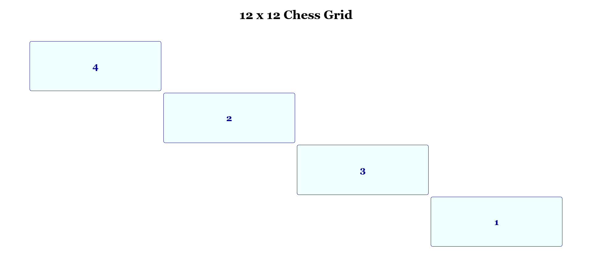

# 12 x 12 grid page (Front End Developer Course)

The page was created as part of the [Front End Developer Course by Orange DC](https://digitalcenter.orange.md/).

## Table of contents
- [12 x 12 grid page (Front End Developer Course)](#12-x-12-grid-page-front-end-developer-course)
  - [Table of contents](#table-of-contents)
    - [Screenshot](#screenshot)
    - [The task and my comments](#the-task-and-my-comments)
    - [Author](#author)

### Screenshot

### The task and my comments

Creating a 12 x 12 grid page that contains 4 elements (items).
All elements must have the same size.
The order of their arrangement is: 4 - 2 - 3 - 1.

My comments: all tasks are done.

### Author

[Andrei Martinenko](https://github.com/AxinitM)
