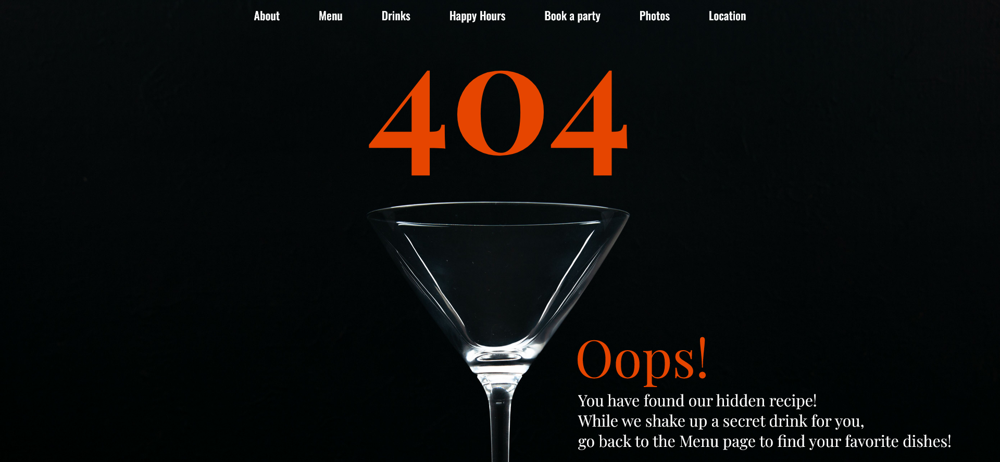

# 404 page (Front End Developer Course)

404 page. The page was created as part of the [Front End Developer Course by Orange DC](https://digitalcenter.orange.md/).

## Table of contents
- [Screenshot](#screenshot)
- [Links](#links)
- [The task and my comments](#the-task-and-my-comments)
- [Built with](#built-with)
- [What I learned](#what-i-learned)
- [Author](#author)

### Screenshot

### Links

[Solution URL](https://axinitm.github.io/ODC-404-page/)

### The task and my comments

Creating a 404 page.

My comments:

- users will see this page when they go to the missing/deleted/lost page of the bar/restaurant website etc.;
- image is made as a background;
- navigation menu is "glued" to the top of the page;
- when hovering the cursor over the menu items, they turn green;
- the photo is used under a free license from Freepik (the license is located in /image);
- the page is not optimized for mobile screens.

### Built with

- Semantic HTML5 markup;
- vanilla CSS;
- Flexbox.

### What I learned

This task improved my knowledge in HTML (semantic code, etc.), CSS (flexbox, background-image, nesting etc.).

### Author

[Andrei Martinenko](https://github.com/AxinitM)
