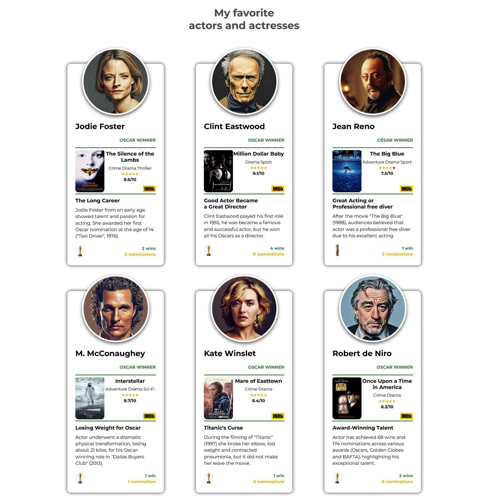

# My favorite actor and actresses (Front End Developer Course)

The page was created as part of the [Front End Developer Course by Orange DC](https://digitalcenter.orange.md/).

## Table of contents
 - [Screenshot](#screenshot)
 - [Links](#links)
 - [The task and my comments](#the-task-and-my-comments)
 - [Built with](#built-with)
 - [Author](#author)

### Screenshot

### Links

[My favorite actor and actresses URL](https://axinitm.github.io/ODC-Actors/)

### The task and my comments

Creating a page with favorite actresses and actors.
My comments: all tasks are accomplished.
Additional functions: movie poster zooms in when you put the cursor over it.

### Built with

- Semantic HTML5 markup;
- vanilla CSS;

### Author

[Andrei Martinenko](https://github.com/AxinitM)
