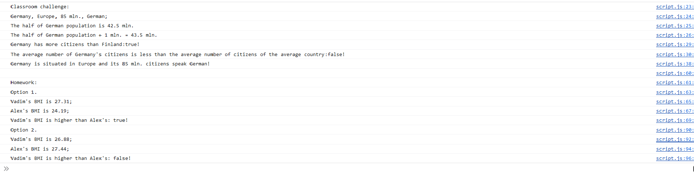

# JS experiments BMI (body mass index) and country card (Front End Developer Course)

The page was created as part of the [Front End Developer Course by Orange DC](https://digitalcenter.orange.md/).

## Table of contents
- [Screenshot](#screenshot)
- [The tasks and my comments](#the-tasks-and-my-comments)
- [Author](#author)

### Screenshot

### The tasks and my comments

Using JS complete a Classroom challenge and Homework.

CLASSROOM CHALLENGE
1. Declare variables named "country", "continent" and "population" and assign them their corresponding values (population in millions), display their values in the console.
2. Declare a variable named "islsland" and set its value according to the chosen country. The variable should have a boolean value. Also declare a variable "language", but do not assign a value to it yet.
3. Display the types of the values "islsland", "population", "country" and "language" in the console. 
4. Set the value "language" to the language spoken in the chosen country.
5. If your country were divided in half and each half contained half the population, then how many people would live in each half?
6. Increase the population of your country by 1 million and record the result in the console.
7. Finland has a population of 6 million. Does your country have more people than Finland?
8. The average population of a country is 33 million people. Does your country have fewer people than the average country?
9. Based on the variables you created, create a new variable "description" containing a string with this format: "Portugal is in Europe and its 11 million people speak Portuguese"

HOMEWORK:
Vadim and Alex are trying to compare their BMI (body mass index), which is calculated using the formula: BMI = mass / height ** 2 (mass in kg and height in meters).
1. Store Vadim and Alex's mass and height in variables
2. Calculate both BMI using the formula (you can even implement both variants)
3. Create a boolean variable "markHigherBMI" containing information about whether Vadim has a higher BMI than Alex. 
Var. 1: Vadim weighs 78 kg and is 1.69 m tall. Alex weighs 92 kg and is 1.95 m tall. 
Var. 2: Vadim weighs 95 kg and is 1.88 m tall. Alex weighs 85 kg and is 1.76 m tall.

My comments: all task done. 

### Author

[Andrei Martinenko](https://github.com/AxinitM)
