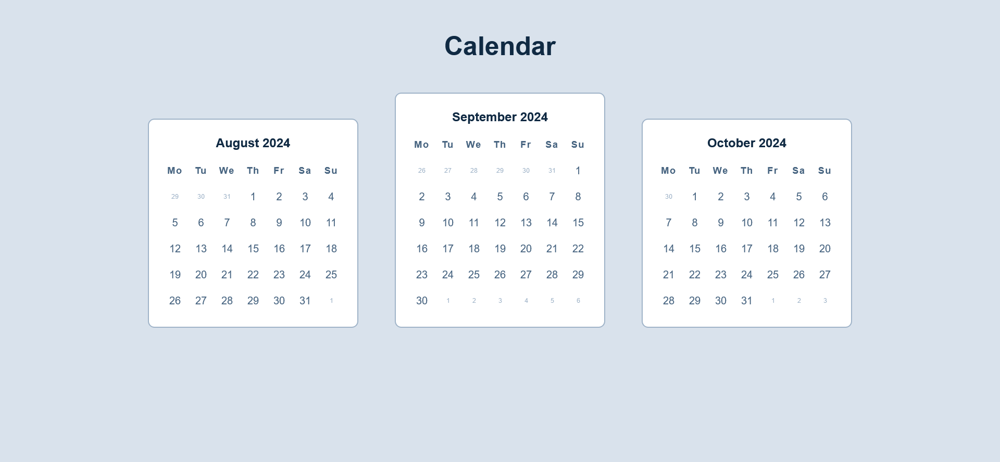

# Calendar page

The page was created as part of the [Front End Developer Course by Orange DC](https://digitalcenter.orange.md/).

## Table of contents
- [Screenshot](#screenshot)
- [Links](#links)
- [Tasks](#tasks)
- [Calendar Page Code Description](#calendar-page-code-description)
- [Author](#author)

## Screenshot

## Links

[Calendar Page](https://axinitm.github.io/ODC-Calendar-page/)

## Tasks

Create a Calendar page.

## Calendar Page Code Description

This code creates a web page with a calendar that automatically adapts to different screen sizes thanks to the use of media queries and flexible layout. When hovering over a date in the current month, a green circular border appears around the date, and the date turns dark green. When hovering over dates from the previous or next month, a red border appears around them.

## Author

[Andrei Martinenko](https://github.com/AxinitM)
