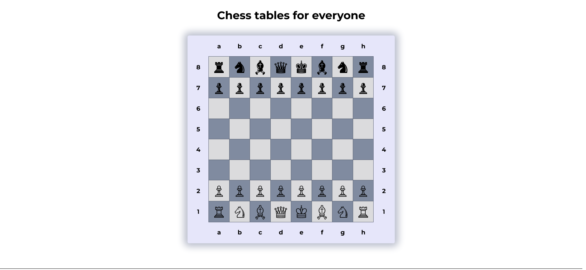

# Chess table page (Front End Developer Course)

The page was created as part of the [Front End Developer Course by Orange DC](https://digitalcenter.orange.md/).

## Table of contents
- [Chess table page (Front End Developer Course)](#chess-table-page-front-end-developer-course)
  - [Table of contents](#table-of-contents)
    - [Screenshot](#screenshot)
    - [Links](#links)
    - [The task and my comments](#the-task-and-my-comments)
    - [Built with](#built-with)
    - [What I learned](#what-i-learned)
    - [Author](#author)

### Screenshot

### Links

[Chess table page URL](https://axinitm.github.io/ODC-Chess-Table/)

### The task and my comments

Creating a Chess table page.
The chess board page should:
- contain an first-level header and a chessboard (8x8, individual squares, white and black pieces, board edges numbered 1 - 8 and a - h);
- the chess pieces are in Unicode;
- each square/cell changes its color when hovering over it;
- when you hover over the chess pieces, they change color, and a tooltip with the name of the chess piece appears on the right. For black pieces, the tooltip is white text on a black background and white border, and for white pieces, it is black text on a white background and black border.

My comments: all tasks are done: cells/fields change color when hovering the cursor, shapes change color and tooltips etc.

### Built with

- Semantic HTML5 markup;
- vanilla CSS;

### What I learned

This task improved my knowledge in HTML (semantic code, tables, etc.), CSS (selectors, pseudo-classes, pseudo-elements, nesting etc.).

### Author

[Andrei Martinenko](https://github.com/AxinitM)
