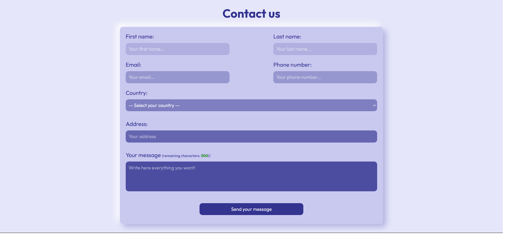

# Contact Form v.1 (no flags)

There is a contact form. The page was created as part of the [Front End Developer Course by Orange DC](https://digitalcenter.orange.md/).

## Table of contents
- [Screenshot](#screenshot)
- [Links](#links)
- [The task and my comments](#the-task-and-my-comments)
- [Built with](#built-with)
- [What I learned](#what-i-learned)
- [Author](#author)

### Screenshot

### Links

[Solution URL](https://axinitm.github.io/ODC-Contact-form/)

### The task and my comments

Creating a contact page , using gradient, flexbox etc.

My comments:
- limited the number of characters that can be entered in the textarea (no more than 300 characters). I put a counter that shows the users how many more characters they can enter. The standard color of the counter is green, when the user has 20 and 10 characters left - the counter becomes dark-red and red. JS was used to create the counter;
- for the fields of information input there is a check: if the entered information corresponds to the cell, it has a green frame. If the information is not correct - the green frame does not appear;
- for the first time in the code used JS: created a counter of entered characters for textarea.

### Built with

- Semantic HTML5 markup
- vanilla CSS
- Flexbox;
- Java Script.

### What I learned

This task improved my knowledge in HTML (semantic code, img etc.), CSS (flexbox, :root, nesting,  etc.), JS (making counter).

### Author

[Andrei Martinenko](https://github.com/AxinitM)
