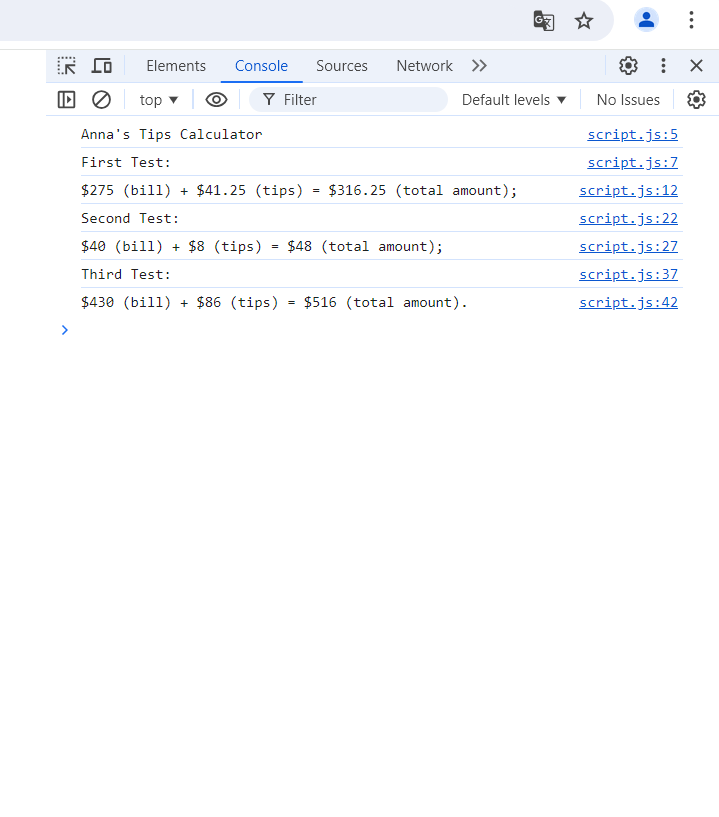

# Anna's Tips Calculator

The page was created as part of the [Front End Developer Course by Orange DC](https://digitalcenter.orange.md/).

## Table of contents
- [Screenshot](#screenshot)
- [The tasks and my comments](#the-tasks-and-my-comments)
- [Author](#author)

### Screenshot

### The tasks and my comments

Anna wants to build a very simple tip calculator for whenever she goes out to eat in a restaurant. In her country, it is customary to tip 15% if the bill is between 50 and 300. If the amount is different, tip 20%.
1. Your task is to calculate the tip, depending on the value of the bill. Create a variable called "tip" for this. You are not allowed to use an if/else statement.
2. Print to the console containing the invoice amount, the tip, and the final amount (bill + tip).
3. Test for bills values 275, 40 and 430 dollars.

My comments: all task done. 

### Author

[Andrei Martinenko](https://github.com/AxinitM)
