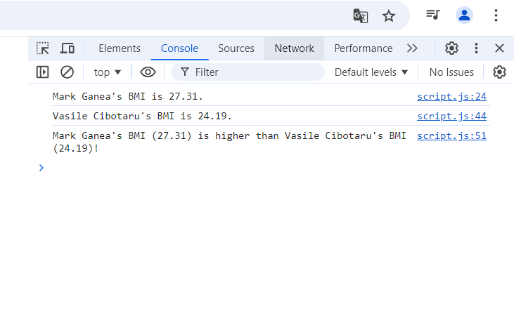

# JS experiments (Homework / Lesson 29)

The page was created as part of the [Front End Developer Course by Orange DC](https://digitalcenter.orange.md/).

## Table of contents
- [Screenshot](#screenshot)
- [The tasks and my comments](#the-tasks-and-my-comments-full-description-of-the-tasks-in-the-code)
- [Author](#author)

## Screenshot

## The tasks and my comments

Homework exercise:

Improving the BMI calculator.
1. Create an object with properties for their full name, mass and height for Mark Ganea and Vasile Cibotaru.
2. Create a "calcBMI" method on each object to calculate BMI (same method for both objects). 
   Store the BMI value in a property and also return it from the method.
3. Display in the console who has the higher BMI, along with their full name and respective BMI. 
4. TEST DATA: Mark weighs 78 kg and is 1.69 m tall. Vasile weighs 92 kg and is 1.95 m tall.
    
My comments: all task done. 

## Author

[Andrei Martinenko](https://github.com/AxinitM)
