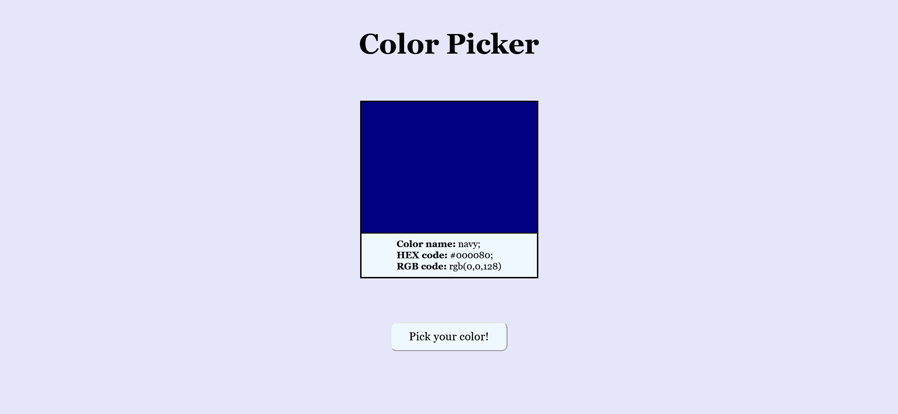

# Color Picker (JS /Lesson 31)

The page was created as part of the [Front End Developer Course by Orange DC](https://digitalcenter.orange.md/).

## Table of contents
- [Screenshot](#screenshot)
- [Links](#links)
- [The tasks and my comments](#the-tasks-and-my-comments)
- [Author](#author)

## Screenshot

## Links

[Color Picker page]()

## The tasks and my comments

Color Picker
Create a page that allows users to randomly get a color when they click on the main button, 
while displaying a field in a given color, its name, rgb and hex codes.
    
My comments: all task done. 

## Author

[Andrei Martinenko](https://github.com/AxinitM)
