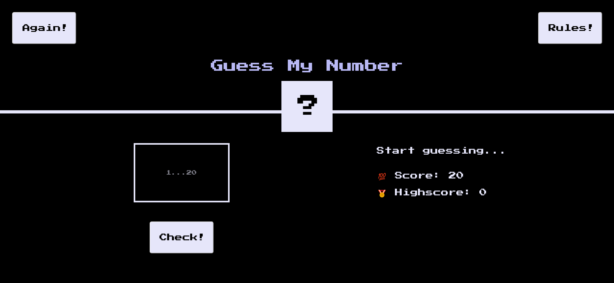

# Guess My Number (game)

The page was created as part of the [Front End Developer Course by Orange DC](https://digitalcenter.orange.md/).

## Table of contents
- [Screenshot](#screenshot)
- [Links](#links)
- [Guess the Number Game Description](#guess-the-number-game-description)
- [Author](#author)

## Screenshot

## Links

[Guess the Number Game Page](https://axinitm.github.io/ODC-Guess-the-Number-Game/)

## Guess the Number Game Description

The computer randomly selects a number between 1 and 20. The player has 20 attempts to guess this number. The number of remaining attempts is displayed in the Score section.

After entering a number, the player can check their guess by pressing the “Check” button or the “Enter” key. After each attempt, the computer will provide feedback on whether the guessed number is correct or whether the player needs to guess a higher or lower number. Entering numbers less than 1 or greater than 20 is considered an error and counts as an attempt.

If the player guesses the correct number, the game will congratulate them with a victory. The screen will turn green, and a celebratory confetti animation will play.

If the player does not guess the number within 20 attempts, the screen will turn red, and a small sad confetti animation will play. At the end of the game, the correct number will be displayed in the center square instead of the “?” sign. The “Check” button will disappear, and the “Try Again!” button will turn green. Clicking this button will restart the game.

The player can restart the game at any time by clicking the “Try Again!” button. This action will reset the current attempt count to zero but will retain the highscore from the current session. The highscore can be reset by reloading the game page (F5).

We wish you a great game and lots of fun! 

P.S. If you want to read the computer's mind, watch the console!

## Author

[Andrei Martinenko](https://github.com/AxinitM)
