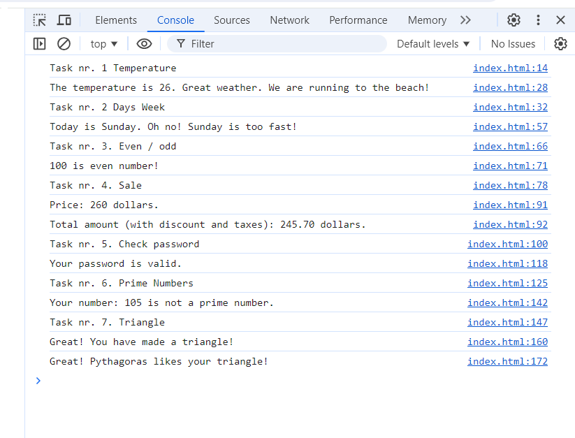

# JS experiments (Homework / Lesson 22)

The page was created as part of the [Front End Developer Course by Orange DC](https://digitalcenter.orange.md/).

## Table of contents
- [Screenshot](#screenshot)
- [The tasks and my comments](#the-tasks-and-my-comments)
- [Author](#author)

### Screenshot

### The tasks and my comments

Homework:

1. Create a "temperature" variable. Use if/else statements to check if the temperature is below 0 (freezing), between 0 and 10 (cold), between 11 and 25 (moderate), or above 25 (warm). Display the appropriate temperature category.

2. Create a "day" variable with a value from 1 to 7, where 1 is Monday and 7 is Sunday. Use if/else statements to display the name of the day. For example, if day is 1, display "Monday"; if day is 5, display "Friday".

3. Given a "number" variable, use if/else statements to determine whether the number is odd or even. Display "Even" if the number is even and "Odd" if it is odd.

4. Create a variable "purchaseAmount" and determine the total cost after applying a discount and adding tax. If purchaseAmount is greater than or equal to 100, we apply a 10% discount. For all amounts, we add a 5% tax to the total after discount (as needed). Show the final amount due.

5. Create a password variable and use if/else statements to check password complexity. If the password is at least 12 characters long and contains both uppercase letters, lowercase letters, and digits, display "Password very secure". If the password is at least 8 characters long and contains uppercase letters and lowercase letters, display "Secure Password". If the password is at least 6 characters long and contains only letters, display "Weak Password". Otherwise, display "Insecure password".

6. Write a JavaScript program to check if a given number is a prime number. A prime number is a number greater than 1 that has no positive divisors other than 1 and itself.

7. The sum of the lengths of two sides of a triangle must be greater than the length of the third side. For example, the numbers 3, 4 and 5 can form a triangle because 3+4>5, 4+5>3 and 5+3>4. In contrast, the numbers 1, 2 and 5 cannot form a triangle because 1+2<5. So, given three integers, you can determine whether they could form a triangle or not by applying this general rule. Given 3 numbers, determine whether they can form a triangle using the above rule. Also, test whether the resulting triangle would be a right triangle using the Pythagorean theorem.

My comments: all task done. 

### Author

[Andrei Martinenko](https://github.com/AxinitM)
