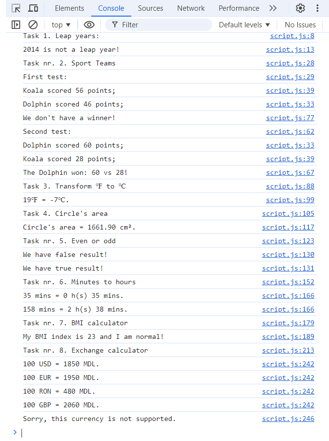

# JS experiments (Homework / Lesson 23)

The page was created as part of the [Front End Developer Course by Orange DC](https://digitalcenter.orange.md/).

## Table of contents
- [Screenshot](#screenshot)
- [The tasks and my comments](#the-tasks-and-my-comments)
- [Author](#author)

### Screenshot

### The tasks and my comments

Homework + additional exercises:

1. Leap years: create a function that tells us whether a year is a leap year or not.

2. Sport Teams v2: new win conditions for the Dolphins and the Koalas sport teams!

3. Temperature conversion: create a function that takes a temperature in Fahrenheit and returns the equivalent in Celsius.

4. Area of a circle: create a function that takes the radius of a circle and returns its area.

5. Even / odd numbers: create a function that takes a number and returns true if the number is even and false if it is odd.

6. Converting minutes to hours and minutes.

7. Calculate and display Body Mass Index (BMI)

8. Exchange rate calculator: create a calculator to convert different currencies (USD, EUR, RON, GBP) to MDL.

My comments: all task done. 

### Author

[Andrei Martinenko](https://github.com/AxinitM)
