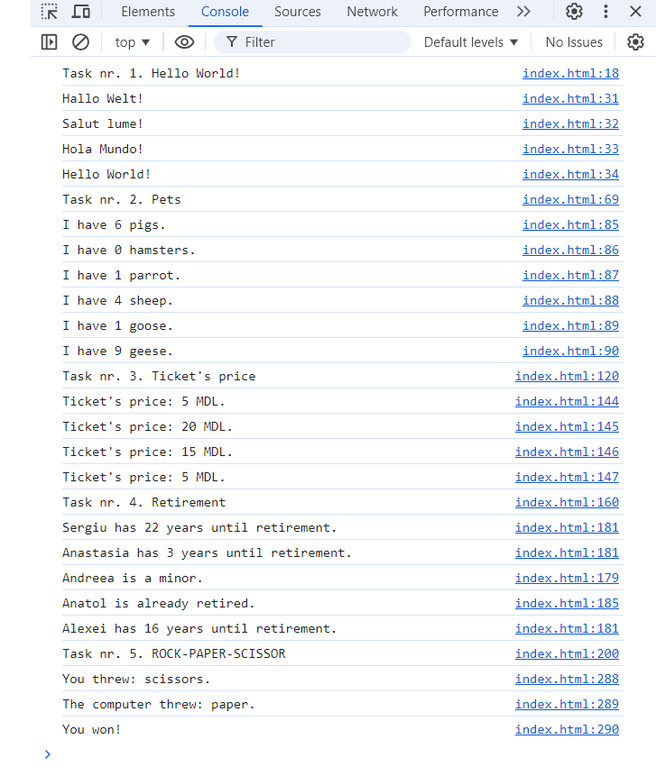

# JS experiments (Homework / Lesson 25)

The page was created as part of the [Front End Developer Course by Orange DC](https://digitalcenter.orange.md/).

## Table of contents
- [JS experiments (Homework / Lesson 25)](#js-experiments-homework--lesson-25)
  - [Table of contents](#table-of-contents)
    - [Screenshot](#screenshot)
    - [The tasks and my comments](#the-tasks-and-my-comments)
    - [Author](#author)

### Screenshot

### The tasks and my comments

Homework + additional exercises:

1. Write a function that accepts 1 argument, a language code (e.g. "es", "de", "en")

2. Write a function about pats.  

3. Create a program that returns ticket price by age.

4. Create a program that tells how many years until retirement.

5. Create a game ROCK-PAPER-SCISSORS (+ cheat door).

My comments: all task done. 

### Author

[Andrei Martinenko](https://github.com/AxinitM)
