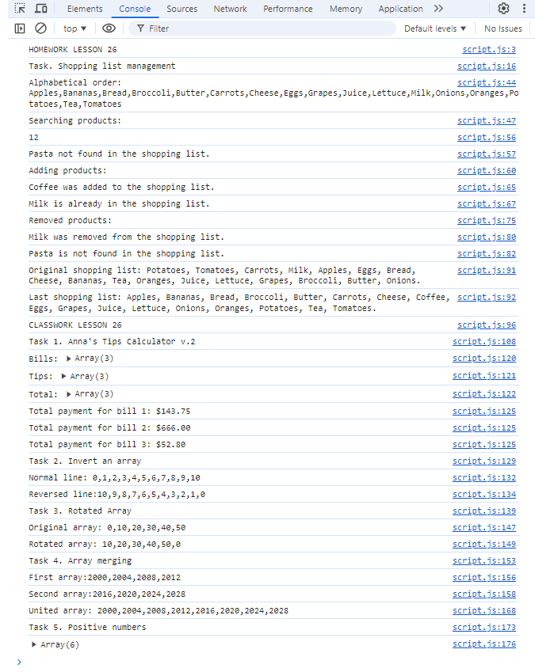

# JS experiments (Homework & Classwork Lesson 26)

The page was created as part of the [Front End Developer Course by Orange DC](https://digitalcenter.orange.md/).

## Table of contents

- [JS experiments (Homework \& Classwork Lesson 26)](#js-experiments-homework--classwork-lesson-26)
  - [Table of contents](#table-of-contents)
  - [Screenshot](#screenshot)
  - [The tasks and my comments, full description of the tasks in the code](#the-tasks-and-my-comments-full-description-of-the-tasks-in-the-code)
  - [Author](#author)

## Screenshot

## The tasks and my comments, full description of the tasks in the code

Homework + Classwork exercises:

1. Shopping list management

2. Ana’s calculator v.2.  

3. Inverted array.

4. Rotate an array by 1 position from the left

5. Create a function that will merge two arrays and return the result as a new array.
   
6. Create a function that receives an array of numbers and returns an array containing only positive numbers.
  
My comments: all task done. 

## Author

[Andrei Martinenko](https://github.com/AxinitM)
