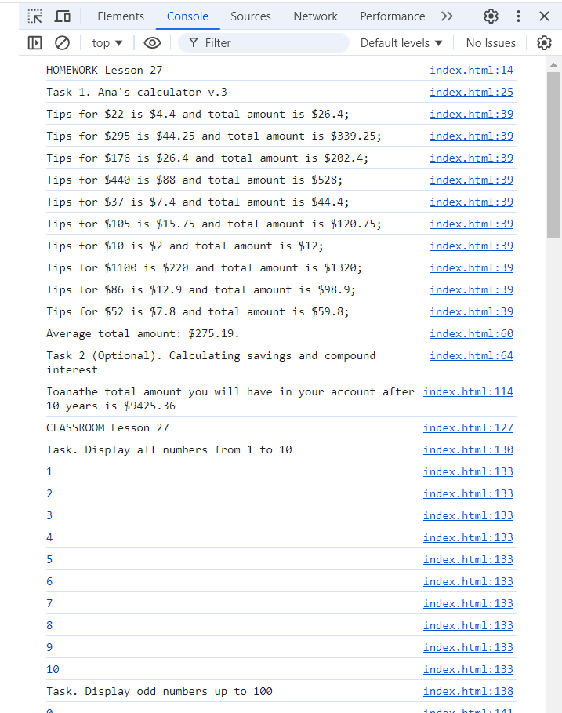

# JS experiments (Homework & Classwork Lesson 27)

The page was created as part of the [Front End Developer Course by Orange DC](https://digitalcenter.orange.md/).

## Table of contents
- [Screenshot](#screenshot)
- [The tasks and my comments, full description of the tasks in the code](#the-tasks-and-my-comments-full-description-of-the-tasks-in-the-code)
- [Author](#author)

## Screenshot

## The tasks and my comments, full description of the tasks in the code

Homework + Classwork exercises:

1. Ana’s calculator v.3
   
2. (Optional). Calculating savings and compound interest"

3. Classroom Exercises (for loop and .reduce()):

4. Classroom Exercises (while loop):
    
My comments: all task done. 

## Author

[Andrei Martinenko](https://github.com/AxinitM)
