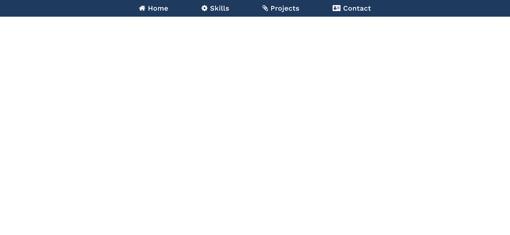

# Navigator Bar Page (Front End Developer Course)

The page was created as part of the [Front End Developer Course by Orange DC](https://digitalcenter.orange.md/).

## Table of contents
- [Screenshot](#screenshot)
- [The task](#the-task)
- [Built with](#built-with)
- [What I learned](#what-i-learned)
- [Author](#author)

## Screenshot

## The task

Create a Navigator Bar Page with a drop-down menu. 
Each item in the drop-down menu should have a “>” sign in front of it.

## Built with

- Semantic HTML5 markup
- vanilla CSS

## Author

[Andrei Martinenko](https://github.com/AxinitM)
