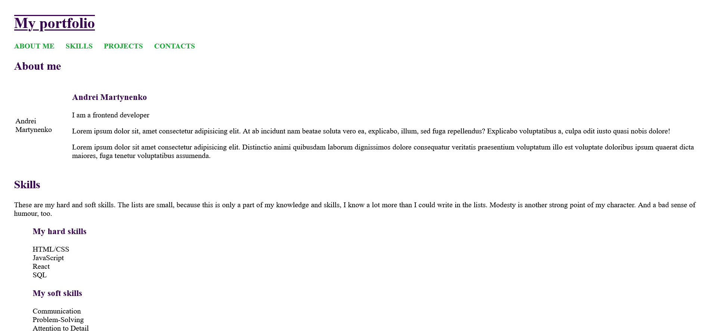

# Front End Developer Course - Portfolio v.2

This project is part of the [Front End Developer Course by Orange Digital Centre](https://digitalcenter.orange.md/).

## Table of contents
- [Screenshot](#screenshot)
- [Links](#links)
- [The task](#the-task)
- [Built with](#built-with)
- [What I learned](#what-i-learned)
- [Author](#author)

### Screenshot

### Links

[Solution URL](https://axinitm.github.io/ODC-Portfolio-v2/)

### The task

Complete the second version of the portfolio. 
Add an "About me" page, a couple of project pages, internal and external links.

### Built with

- Semantic HTML5 markup
- Vanilla CSS

### What I learned

This task improved my knowledge in HTML and CSS (semantic code, links, using forms tags, img etc.).

### Author

- GitHub - [Andrei Martinenko](https://github.com/AxinitM)
