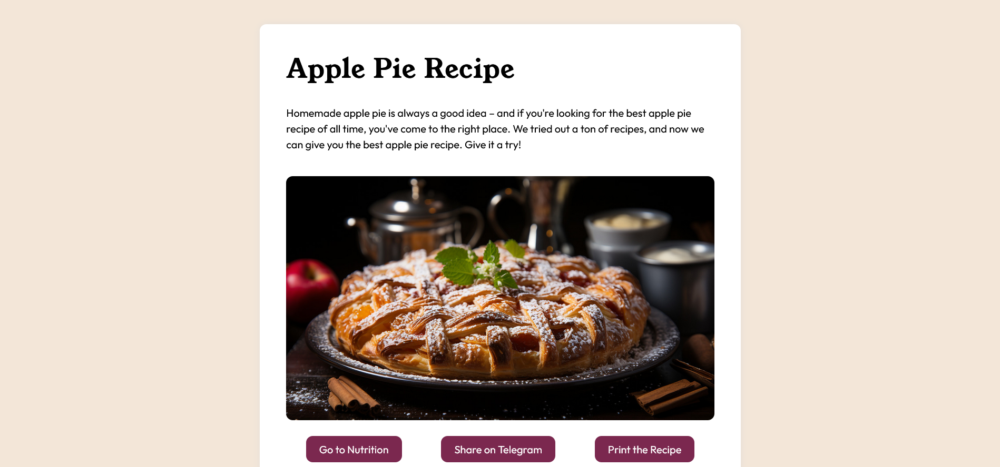

# Recipe Page

This project was done as part of the [Front End Developer Course by Orange Digital Centre](https://digitalcenter.orange.md/).

## Table of contents
- [Screenshot](#screenshot)
- [Links](#links)
- [The task](#the-task)
- [Built with](#built-with)
- [What I learned](#what-i-learned)
- [Author](#author)

### Screenshot

### Links

[Solution URL](https://axinitm.github.io/ODC-Recipe/)

### The task

- Create an HTML document that will represent a recipe page for a specific dish.
- Add a top-level title with the name of the dish.
- Add an image of the dish using the tag and include the alt attribute
- Add a paragraph containing a short description of the dish.
- Create an unordered list to list the required ingredients
- Create an ordered list to list step-by-step instructions for preparation
- Add a link to an external page containing the full recipe.
- Create a form with fields for name and comment. Use the required attribute to make these fields required
- Create a table to display information about the nutritional value, such as the number of calories, protein, fat and carbohydrates.
- Add a "Back" button that, when clicked, returns the user to the previous page in the browsing history.

### Built with

- Semantic HTML5 markup
- CSS custom properties
- Flexbox

### What I learned

This task improved my knowledge in HTML (semantic code, using forms tags, img etc.) and CSS (Flexbox, nesting, margins, paddings etc.).

### Author

- GitHub - [Andrei Martinenko](https://github.com/AxinitM)
