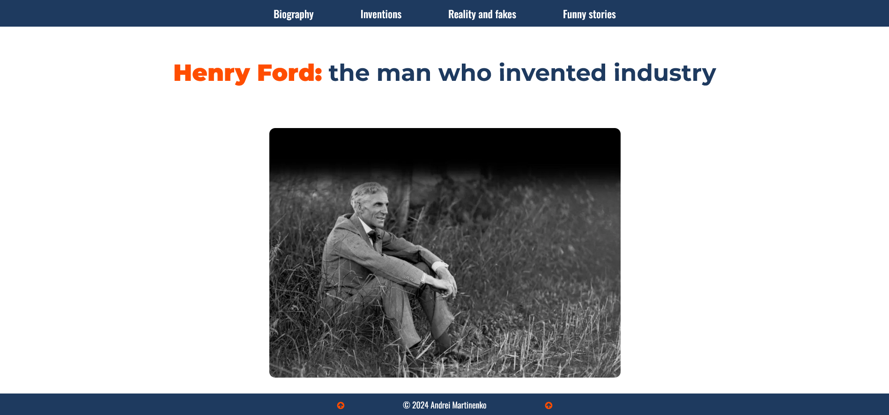

# A Tribute Page to Henry Ford 

The page was created as part of the [Front End Developer Course by Orange DC](https://digitalcenter.orange.md/).

## Table of contents
- [Screenshot](#screenshot)
- [Links](#links)
- [The task and the page description](#the-task-and-the-page-description)
- [Author](#author)

## Screenshot

## Links

[Page URL](https://axinitm.github.io/ODC-Tribute-Page/)

## The task and the page description

Creating a page dedicated to a famous person (tribute page).

Page description:
- footer is «glued» to the bottom of the visible area and it is always visible to the user; 
- the photos (Inventions section) are doubled when the cursor is hovered over;
- the footer contains two buttons that change color to green when the cursor is hovered over them. When clicking on them - the user goes to the top of the page;
- the top menu (header) is created with < ol > and < il >, but the bottom menu (footer) is created with flexbox and < p >. This was my experiment and testing the performance of each variant.

## Author

- Website - [Andrei Martinenko](https://www.frontender.biz)
- Github - [@AxinitM](https://github.com/AxinitM)
- Frontend Mentor - [@AxinitM](https://www.frontendmentor.io/profile/AxinitM)
