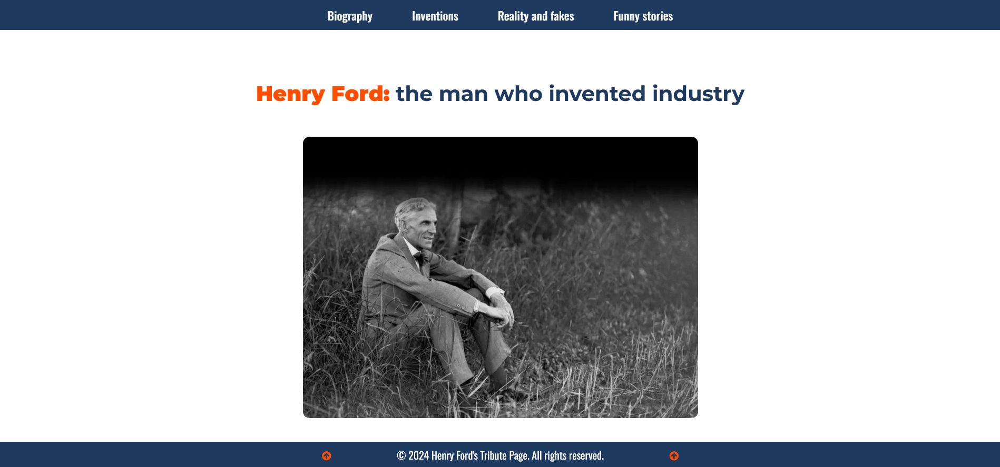

# Tribute Page (Front End Developer Course)

There is a tribute page to H. Ford, creator of the T-Model car. The page was created as part of the [Front End Developer Course by Orange DC](https://digitalcenter.orange.md/).

## Table of contents
- [Screenshot](#screenshot)
- [Links](#links)
- [The task and my comments](#the-task-and-my-comments)
- [Built with](#built-with)
- [What I learned](#what-i-learned)
- [Author](#author)

### Screenshot

### Links

[Solution URL](https://axinitm.github.io/ODC-Tribute-page/)

### The task and my comments

Creating a page dedicated to a famous person (tribute page).

My comments:
- header and footer are "glued" to the bottom of the visible area and they are always visible;
- the photos (Inventions section) are doubled when the cursor is hovered over;
- the footer contains two buttons that change color to green when the cursor is hovered over them. When clicking on them - the user goes to the top of the page;
- the top menu (header) is created with < ol > and < il >, but the bottom menu (footer) is created with flexbox and < p >. This was my experiment and testing the performance of each variant.

The code is not perfect, so I am willing to listen to any constructive criticism and comments.

### Built with

- Semantic HTML5 markup
- vanilla CSS
- Flexbox

### What I learned

This task improved my knowledge in HTML (semantic code, img etc.), CSS (Flexbox, @font-face, @import, :root, nesting, text-transform etc.).

### Author

[Andrei Martinenko](https://github.com/AxinitM)
